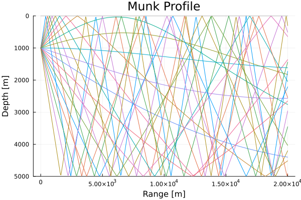

# OceanAcoustics
An implementation of acoustics models in the context of long-range ocean propagation.

## Development Roadmap (Epics)
* Models:
  * Ray/beam tracing
  * Parabolic equation
  * Sonar equations
* Auxiliary:
  * Example scenarios
  * Plot recipes

### Tasks
Dependency-ordered tasks:
* Replace range usage `r` with `x`? Research.
* Improve existing plot recipes:
  * Reverse y-direction in plot recipes.
  * Create celerity plot beside propagation plot.
  * Labels, i.e. title, axes, etc.
* Check initial rays launch within ocean.
* Implement beam tracing, then define plot recipe.
* Implement gridded field approximation, then define plot recipe.
  * Coherent and Incoherent beam summations.
  * Gridded approximation.
* LaTeX document: Mathematics.
* Julia document: Implementation.
  * Document model features, comparing with and referencing literature.
  * Give background and applications.

Side tasks:
* Docstrings and comments in the source code.
* Colour rays by launch angle magnitude and sign.
* Ribbon the bathymetry and surface plotting.
* Implement more example `Scenario`s.
  * Balearic sea [Jensen et al. p 171]
* Implement more tests.
* Document sonar equations.