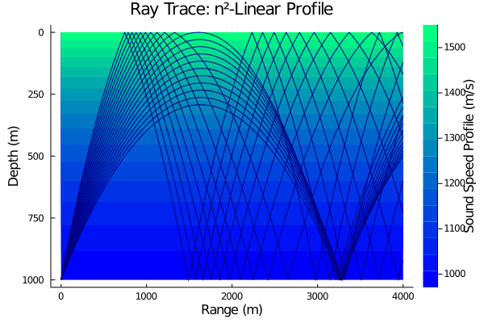
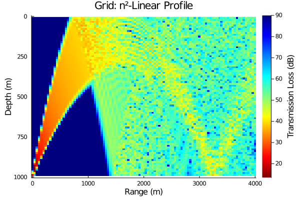

# OceanAcoustics.jl

| Feature  | Status  |
| --- | --- |
| License | [](https://opensource.org/licenses/MIT) |
| Docs | |
| Linux | [](https://travis-ci.com/kapple19/OceanAcoustics.jl) |
| Windows | [](https://ci.appveyor.com/project/kapple19/OceanAcoustics-jl) |
| Coverage | [](https://codecov.io/gh/kapple19/OceanAcoustics.jl) [](https://coveralls.io/github/kapple19/OceanAcoustics.jl?branch=master) |

An implementation of ocean acoustics models in literature, written in the Julia programming language.

Note, this package is still under development, and not yet registered.

## Installation
At the Julia REPL, execute:
```julia
using Pkg
Pkg.add("OceanAcoustics")
```

## Usage
To load, execute:
```julia
using OceanAcoustics
```

### Ray Tracing
1. Define the environment:

```julia
c₀ = 1550
c(r, z) = c₀/√(1 + 2.4z/c₀)
range_max = 4e3
depth_max = 1e3

ocn = Medium(c)
bty = Boundary(depth_max)
env = Environment(range_max, ocn, bty)
```

2. Specify the scenario:

```julia
r₀ = 0.0
z₀ = depth_max
θ_crit = ocn.SSP.c(r₀, z₀)/ocn.SSP.c(r₀, 0) |> acos
θ₀s = θ_crit * LinRange(-1.2, -0.8, 21)

fan = Fan(θ₀s)
src = Source(Position(r₀, z₀), Signal(2e3), fan)
scn = Scenario(env, src, "n²-Linear Profile")
```

3. Trace and plot rays:

```julia
trc = Trace(scn)
p = plot_oac(scn.env)
plot_oac!(trc)
```



4. Calculate transmission loss field (dev):

```julia
fld = Field(trc)
grid = Grid(fld)
plot_oac(grid)
```



## Motivation
There are a variety of ocean acoustics modelling software available online, which prompts asking for the purpose of yet another one.
* **Core code legibility**: Due to the heavy computational power needed, other model implementations are performed in C++ or Fortran where readability is low and bugs are difficult to resolve.
* **Automatic differentiation**: Julia allows the quick and easy utilization of continuous functions and the fast calculation of their smooth derivatives, avoiding artefacts of discretisation found in other implementations.
* **Easy multithreading**: Some solvers are written in Matlab, which lacks scalability. Julia places the full power of computation in the hands of the scientist while having legible code.
* **Reliable programming suite**: Julia's packages are community-driven and -proven, ensuring quality performance and reliability.
  * DifferentialEquations.jl: Differential equation solver suite.
  * Interpolations.jl: Trustworthy interpolation.
  * ForwardDiff.jl: Latest methods in calculating derivatives - minimisation of discretization.

## Development Plan
The following features are under development:
* **Documentation**:
  * Examples, replicating literature results
  * Extensive usage details
  * Implementation
  * Mathematical theory
* Corner cases that produce logical or other runtime errors
* More robust function and struct designs:
  * **GPU** utilization
  * **Multithreading** for the numerous rays being traced
* Transmission loss field calculation for multipath rays:
  * Gaussian beam tracing
  * Interpolation onto range-depth grid
  * Summation
* Sonar equations:
  * Detection index
  * Signal excess
  * Probability of detection
* GUI production:
  * Interactive plot selection and data handling
  * Comparison of multiple scenarios

For proof of concept of the sonar equations, see [the author's earlier work](https://github.com/kapple19/OceanAcousticsModelling).

## References
The theory implemented in this package has been taken from the following intellectual giants.

> Jensen, Finn B., et al. Computational ocean acoustics. Springer Science & Business Media, 2011.

> Lurton, Xavier. Underwater acoustics: an introduction. Springer Berlin, 2010.

## Dependencies
This package stands on the shoulders of Julia giants.

> [Julia](https://github.com/JuliaLang/julia): Bezanson, Jeff, et al. "Julia: A fresh approach to numerical computing." SIAM review 59.1 (2017): 65-98.

> [OrdinaryDiffEq.jl](https://github.com/SciML/OrdinaryDiffEq.jl): Rackauckas, Christopher, and Qing Nie. "Differentialequations. jl–a performant and feature-rich ecosystem for solving differential equations in julia." Journal of Open Research Software 5.1 (2017).

> [ForwardDiff.jl](https://github.com/JuliaDiff/ForwardDiff.jl): Revels, Jarrett, Miles Lubin, and Theodore Papamarkou. "Forward-mode automatic differentiation in Julia." arXiv preprint arXiv:1607.07892 (2016).

> [Documenter.jl](https://github.com/JuliaDocs/Documenter.jl)

> [Interpolations.jl](https://github.com/JuliaMath/Interpolations.jl)

> [Roots.jl](https://github.com/JuliaMath/Roots.jl)

> [IntervalArithmetic.jl](https://github.com/JuliaIntervals/IntervalArithmetic.jl)
