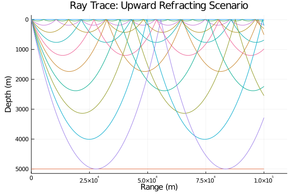

# OceanAcoustics.jl

[](https://travis-ci.com/kapple19/OceanAcoustics.jl)
[](https://ci.appveyor.com/project/kapple19/OceanAcoustics-jl)
[](https://codecov.io/gh/kapple19/OceanAcoustics.jl)
[](https://coveralls.io/github/kapple19/OceanAcoustics.jl?branch=master)

This package is an implementation of ocean acoustics models found in literature, written in the Julia programming language.

Note, this package is still under development, and not yet registered.

## Installation
At the Julia REPL, execute the following commands.

```julia
using Pkg
Pkg.add("OceanAcoustics")
```

## Usage
To load the package, execute

```julia
using OceanAcoustics
```

at the Julia REPL.

### Ray Tracing
1. Define the environment parameters:

```julia
c(r, z) = 1500 + 100z/5e3 # sound speed
zBty = 5e3 # bathymetry
zAti = 0.0 # altimetry
r₀ = 0.0 # source range
z₀ = 0.0 # source depth
θ_crit = acos(c(r₀, z₀)/c(r₀, zBty)) # critical angle
θ₀ = θ_crit*range(0.1, 1, length = 10) # initial ray angles
f = 2e2 # frequency
R = 1e5 # maximum range
```

2. Parse the scenario:

```julia
ocn = Medium(c, R)
bty = Boundary(zBty)
ati = Boundary(zAti)
src = Source(Position(r₀, z₀), Signal(f))
```

3. Trace rays:

```julia
rays = Ray.(θ₀, src, ocn, bty, ati)
```

4. Plot rays:

```julia
p = plot(xaxis = "Range (m)",
	yaxis = ("Depth (m)", :flip),
	title = "Ray Trace: Upward Refracting Scenario")
plot!([0, R], ati.z)
plot!([0, R], bty.z)
for nRay = 1:length(rays)
	plot!(rays[nRay].sol, vars = (1, 2))
end
display(p)
```



## Motivation
There are a variety of ocean acoustics modelling software available online, which prompts asking for the purpose for yet another one.
* **Core code legibility**: Due to the heavy computational power needed, other model implementations are performed in C++ or Fortran where readability is low and bugs are difficult to resolve.
* **Automatic differentiation**: Julia allows the quick and easy utilization of continuous functions and the fast calculation of their smooth derivatives, avoiding artefacts of discretisation found in other implementations.
* **GPU, parallelisation, and distributed computing**: Some solvers are written in Matlab, which lacks scalability. Julia places the full power of computation in the hands of the scientist.
* **Reliable programming suite**: Julia's packages are community-driven and -proven, ensuring quality performance and reliability.
  * DifferentialEquations.jl: Differential equation solver suite.
  * Interpolations.jl: Trustworthy interpolation.
  * ForwardDiff.jl: Modern methods in calculating derivatives - minimisation of discretization.

## Development Plan
The following features are under development:
* Documentation:
  * Extensive usage details
  * Implementation
  * Mathematical theory
* Corner cases that produce logical or other runtime errors
* More robust function and struct designs
* GPU utilization
* Transmission loss field calculation for multipath rays:
  * Gaussian beam tracing
  * Interpolation onto range-depth grid
  * Summation
* Sonar equations:
  * Detection index
  * Signal excess
  * Probability of detection
* GUI production:
  * Interactive plot selection and data handling
  * Comparison of multiple scenarios

For proof of concept of the sonar equations, see [the author's earlier work](https://github.com/kapple19/OceanAcousticsModelling).

## References
The theory implemented in this package has been taken from the following intellectual giants.

> Jensen, Finn B., et al. Computational ocean acoustics. Springer Science & Business Media, 2011.

> Lurton, Xavier. Underwater acoustics: an introduction. Springer Berlin, 2010.

## Dependencies
This package stands on the shoulders of Julia giants.

> [Julia](https://github.com/JuliaLang/julia): Bezanson, Jeff, et al. "Julia: A fresh approach to numerical computing." SIAM review 59.1 (2017): 65-98.

> [DifferentialEquations.jl](https://github.com/SciML/DifferentialEquations.jl): Rackauckas, Christopher, and Qing Nie. "Differentialequations. jl–a performant and feature-rich ecosystem for solving differential equations in julia." Journal of Open Research Software 5.1 (2017).

> [ForwardDiff.jl](https://github.com/JuliaDiff/ForwardDiff.jl): Revels, Jarrett, Miles Lubin, and Theodore Papamarkou. "Forward-mode automatic differentiation in Julia." arXiv preprint arXiv:1607.07892 (2016).

> [Documenter.jl](https://github.com/JuliaDocs/Documenter.jl)

> [Interpolations.jl](https://github.com/JuliaMath/Interpolations.jl)
