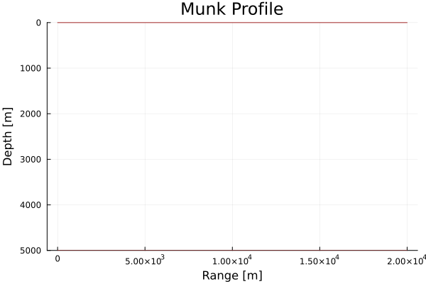

# OceanAcoustics
An implementation of acoustics models in the context of long-range ocean propagation.

## Development Roadmap
* Models:
  * Ray/beam tracing
  * Parabolic equation
  * Sonar equations
* Auxiliary:
  * Example scenarios
  * Plot recipes

### Tasks
* Check initial rays launch within ocean.
* Implement beam tracing.
* Create plot recipes for the various types.